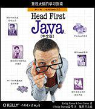
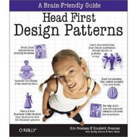
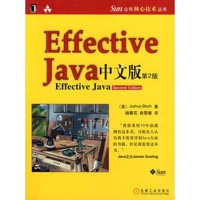
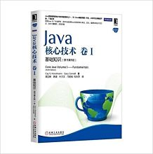
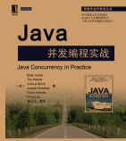

# Java编程思想（镇宅之宝）

 

这本书如果你没有完全看一遍你都不好意思说自己是java程序员，铁打的思想，流水的语言，这本书必须推荐，这本书必须人手一本！

查看详情：https://book.douban.com/subject/2130190/

# Head First Java 

 

这本书被誉为所有编程或者java初学者最适合的书籍，关于Head First 是有一些列的书籍，其中还有设计模式等，这个系列的书写的很有意思，基本上跟看漫画似的，官方说法就是寓教于乐的Head First风格 ，看起来很有意思，不会让你感到枯燥，如果你想详细了解这本书可以看这里https://book.douban.com/subject/2000732/

# Head First 设计模式

 

设计模式在java中是很重要的存在，这本书同样是采取寓教于乐的Head First风格，可以说，让你在觉得有意思的过程中学会设计模式，如果你想学习java中的设计模式，这本书值得推荐。

查看详情：https://book.douban.com/subject/2243615/

# Effective Java

 

这本书据说是一本非常具有影响力的书，单单看到java之父对它的评价就觉得这书不一般，这本书无论从内容还是质量都是评价非常高的，推荐人手一本哦。

查看详情：https://book.douban.com/subject/3360807/

# Java核心技术

 

这本书被称为java领域最有影响力和价值的著作之一，与《java编程思想》齐名，这个是卷一还有一本卷二，挺不错的，初学者可以考虑入手。

查看详情：https://book.douban.com/subject/25762168/

# Java并发编程实战

 这本书基本上就是关于java并发编程和多线程方面的权威了，也是推荐人手一本，用心研究，是值得你反复读的一本书。

查看详情：https://book.douban.com/subject/10484692/

# 深入理解Java虚拟机

 

这本书是整个Java图书领域公认的经典著作和超级畅销书，繁体版在台湾也十分受欢迎 ，是你学习jvm必备的一本书了，而且这书还是我们国人自己写的，必须支持啊，这将是你开启jvm虚拟机大门的第一课。

查看详情：https://book.douban.com/subject/24722612/

​	