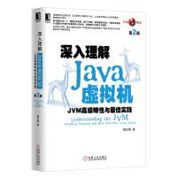
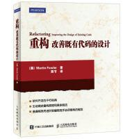
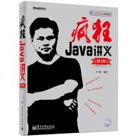
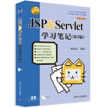
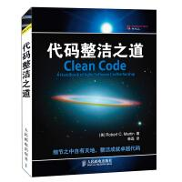
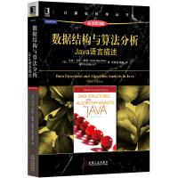
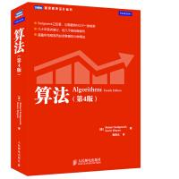
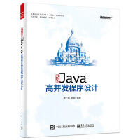
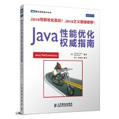
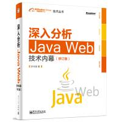

# Java编程思想（镇宅之宝）

 

这本书如果你没有完全看一遍你都不好意思说自己是java程序员，铁打的思想，流水的语言，这本书必须推荐，这本书必须人手一本！

查看详情：https://book.douban.com/subject/2130190/

# Head First Java 

 

这本书被誉为所有编程或者java初学者最适合的书籍，关于Head First 是有一些列的书籍，其中还有设计模式等，这个系列的书写的很有意思，基本上跟看漫画似的，官方说法就是寓教于乐的Head First风格 ，看起来很有意思，不会让你感到枯燥，如果你想详细了解这本书可以看这里https://book.douban.com/subject/2000732/

# Head First 设计模式

 

设计模式在java中是很重要的存在，这本书同样是采取寓教于乐的Head First风格，可以说，让你在觉得有意思的过程中学会设计模式，如果你想学习java中的设计模式，这本书值得推荐。

查看详情：https://book.douban.com/subject/2243615/

# Effective Java

 

这本书据说是一本非常具有影响力的书，单单看到java之父对它的评价就觉得这书不一般，这本书无论从内容还是质量都是评价非常高的，推荐人手一本哦。

查看详情：https://book.douban.com/subject/3360807/

# Java核心技术

 

这本书被称为java领域最有影响力和价值的著作之一，与《java编程思想》齐名，这个是卷一还有一本卷二，挺不错的，初学者可以考虑入手。

查看详情：https://book.douban.com/subject/25762168/

# Java并发编程实战

 

 这本书基本上就是关于java并发编程和多线程方面的权威了，也是推荐人手一本，用心研究，是值得你反复读的一本书。

查看详情：https://book.douban.com/subject/10484692/

# 深入理解Java虚拟机

  

这本书是整个Java图书领域公认的经典著作和超级畅销书，繁体版在台湾也十分受欢迎 ，是你学习jvm必备的一本书了，而且这书还是我们国人自己写的，必须支持啊，这将是你开启jvm虚拟机大门的第一课。

查看详情：https://book.douban.com/subject/24722612/

# 重构--改善既有代码的设计

 

如果你想写好的代码，那么这本书必读。

查看详情：https://book.douban.com/subject/4262627/

# 疯狂Java讲义

 

这本书实我买的第一本Java书籍，可以说，这本书讲的非常仔细，而且配有大量示例代码，基本是每一个知识点都会有相对应的源码，说的很透彻，覆盖所有基础知识，作为入门书籍，个人觉得不错，这本书很厚。

查看详情：https://book.douban.com/subject/25959184/

# JSP & Servlet学习笔记

 

这本书不知道有多少人知道，但是这本书的评价是不错的，可以说是入门JavaWeb不错的选择，详细的介绍了Servlet，jsp和web容器至阿健的关系，还讲解了文本处理，图片验证，自动登陆，过滤器等各种实用范例，推荐！

查看详情：https://book.douban.com/subject/10569600/

# 有效的单元测试

 

如果想学习单元测试，那么这本书可以作为入门的选择。

查看详情：https://book.douban.com/subject/26364867/

# 代码整洁之道

 

这本书的知名度蛮高的，评价也高，推荐必看的一本书！

查看详情：https://book.douban.com/subject/4199741/

# Java数据结构与算法方面的书籍三宝

## 黑宝书

数据结构与算法分析---Java语言描述

 

黑宝书胜在公式推理和证明以及算法的简洁和精炼，此外习题较多。

查看详情：https://book.douban.com/subject/26745780/

## 蓝宝书

大话数据结构

 

蓝宝书胜在对算法的深入浅出的讲解，演示和举例，让艰涩的理论变得很容易理解。 

查看详情：https://book.douban.com/subject/6424904/

## 红宝书

算法

  

红宝书胜在系出名门斯坦福，演示通俗易懂，内容丰富。有了这三宝，算法不用愁，学完以后再看《算法导论》就容易多了。 

查看详情：https://book.douban.com/subject/10432347/

# 实战Java高并发程序设计

 

学习高并发的一本好书，值得入手

查看详情：https://book.douban.com/subject/26663605/

# Java性能权威指南

 

学习Java性能方面必备的书籍，本书专注于Java性能，帮助你理解Java平台性能的各个方面，值得推荐。

查看详情：https://book.douban.com/subject/25828043/

# 深入分析Java Web技术内幕

 

这本书感觉整体还是不错的，都是从原理出发，涉及JavaWeb底层技术，推荐阅读。

查看详情：https://book.douban.com/subject/25953851/

​	